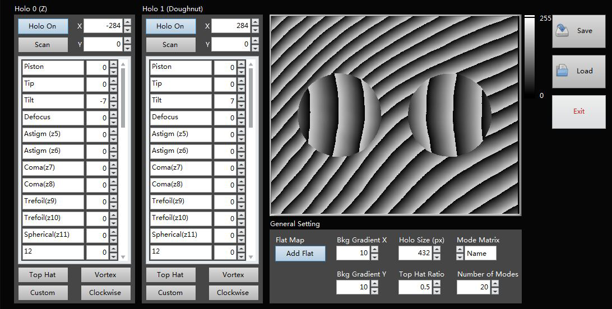

# Spatial Light Modulator Control

This project is to control the spatial light modulator (SLM) by loading proper gray-scale image. Although tested only on Hamamatsu and Holoeye SLMs, this project is theoretically compatible with all SLMs as long as they can be recognized as an extra monitor by your computer.

## Getting Started

These instructions will get you a copy of the project up and running on your local machine for development and testing purposes.

### Prerequisites

To run this program, National Instrument LabVIEW 2018 or later is needed. In addtion, Vision Development Module is essential. The instructions on how to install LabVIEW can be found on NI's website:
(http://www.ni.com/pdf/manuals/375842f.pdf). 

### Installation

This program is portable and hardware-free. No installation is required. Copy or clone the whole project onto your hard drive, and you are all set.

## Running the program

Depending on your hardware, you may have to redefine a few constants (e.g., resolution of SLM) to obtain the expected results before running the program. All these settings can be found in "SLM Constant.vi".

To date, this project only supports one SLM. Assuming that you have multiple SLMs connected to your computer and want to make a switch, you have to quit the program first and modify the "monitor count" in "SLM Constant.vi". The exact sequence number of each SLM can be found in your "Control Panel" of you Windows OS.

Double-click the file "SLM Control.vi" to enter the program. All functions are accessable from the main UI (see figure below). The program can define two holograms on the SLM in total, but you may opt to use only one by clicking either "Holo On" button on the top left of the main UI.

You can manipulate the wavefront of the incident beam by adding your pattern onto the hologram. These patterns are defined using Zernike Polynominals. Alternatively, you can add specific pattern by clicking the buttons like "vortex", "tophat" underneath the Zernike Polynominal list. You may also add the pattern defined by yourself by clicking the "custom" button. To change the user defined pattern, modify "/SLM VIs/Custom.vi" as needed.

The bottom-right control panel is used to control the pattern outside the hologram region. You may add gradient, change the hologram size, enable/disable the flat map here.

All setting can be saved for further use by clicking the "save" button. Then you may recall all saved parameters by clicking the "load" button.

For the basic knowledge regarding the SLM or adaptive optics, you may refer to:
 "https://en.wikipedia.org/wiki/Spatial_light_modulator".

## Versioning

* v4.0 current version
Major update: 
    1. gray scale of flat map is corrected.
    2. An "SLM Constant.vi" is created to enable the users to customize the control based on their own hardware setting. 
    3. other debugs for better performances.

## Authors

* **Xiang Hao** from the Hao Laboratory (https://github.com/Hao-Laboratory) at Zhejiang University, China. Email: haox@zju.edu.cn

## License

This project is licensed under the MIT License - see the [LICENSE.md](LICENSE.md) file for details.

## Acknowledgments

* Edward S. Allgeyer @ University of Cambridge
* Shijie Tu @ Zhejiang University
